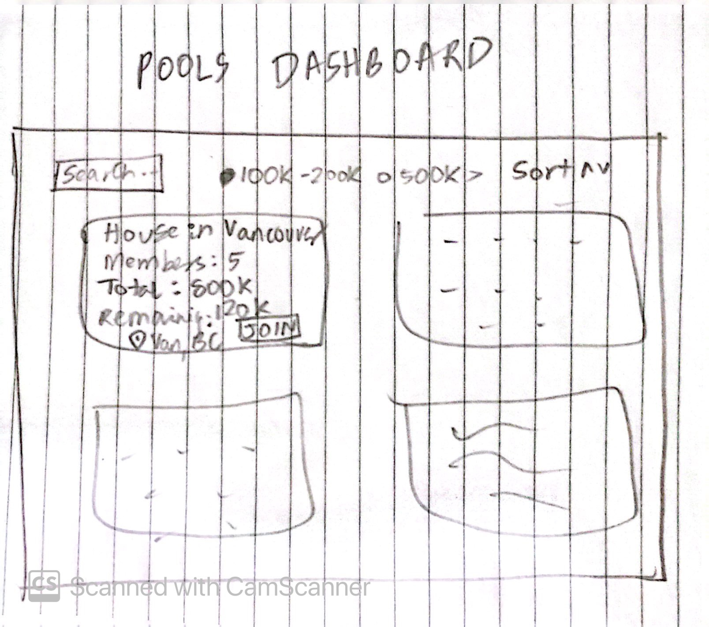
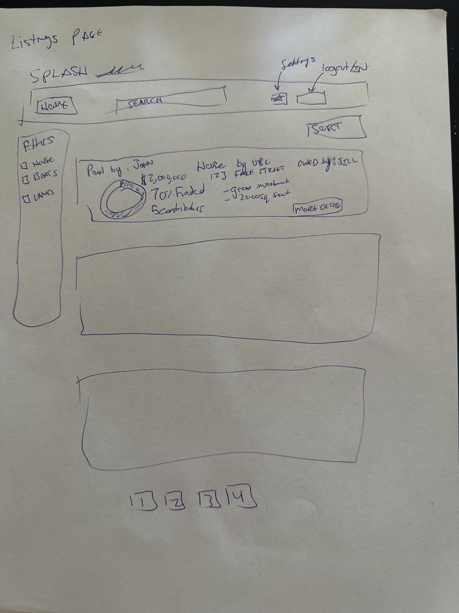
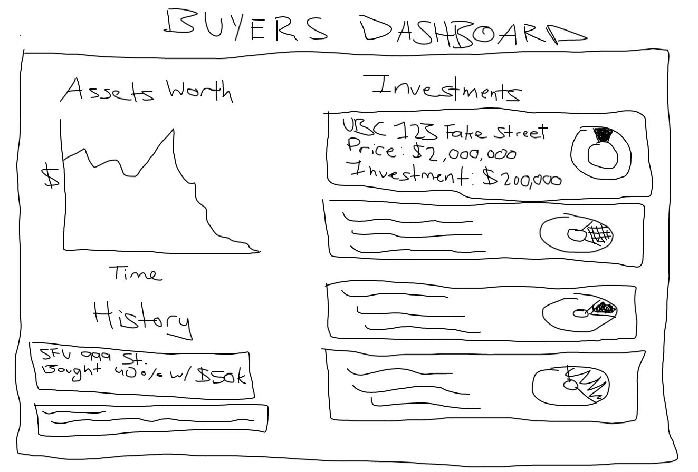

# SPLASH

# Project Description

## Overview

With rising costs and the increased interest from young adults looking to make investments into a multitude of different financial avenues, **Splash** is designed to be a simple way to connect sellers and buyers without a middle man, as well as allow the pooling of financial capital to invest in more profitable assets collectively.

Splash will support several different user types depending on the objective they wish to achieve:

### Buyer

- View listing of available assets to purchase
- View progress of funding for an investment pool
- Purchase up to $value of full purchase price but not over

### Seller

- Add listings (Photos, Descriptions, Price, additional fees)
- Remove listings if not full funded
- Buyers should not be charged / refunded if removed

### Broker (Stretch Goal / Scrape)

- Facilitates actual transaction between the multiple buyers and seller
- Gets a certain % of fees from conducting a transaction
- Buyers and Sellers can give ratings to brokers

## Data Storage

**Listings**

- Listing id
- Owned/ still on market
- User id (owner of listing)

**User Data:**

- User login
- Username and password (encrypted with some hashing) is required, all other info is optional
- List of id’s of assets this user owns and his percentage share
- List of id’s of their created listings

**Investment Pools**

- Pool id
- List of {uid , amount}
- Listing id

## User Interaction with Data

- **Listings Dashboard:** Users will be able to view all listings and filter by preferences
- **User Dashboard**
  - **Seller side Dashboard:** View funding progress towards item seller is selling, select a broker / view a broker to help with the transaction.
  - **Buyer side Dashboard:** View investment breakdown, breakdown of investments purchased history, appreciation / depreciation of assets, and pools they're a part of.
- **Pools Dashboard:** View open pools, filter pools, join pools.

## Additional Functionality

- Each seller who lists a property can be able to mint a crypto token for number of “Shares” ie 1 share per dollar value (Super Stretch Goal).
- Live market bidding
- ML/ dataset based prediction of increase in value of asset
- Private investment pools, shareable and viewable only by token/link holders

# Project Task Requirements

## Minimal Requirements

1. Users should be able to login and signup for the webapp
2. Users should be able to view open listings and filter them
3. Buyers should be able to see owned assets, and view owned asset value
4. Sellers should be able to add a new listing of an asset to the webapp

## Standard Requirements

1. Mock payment on purchase of asset
2. Buyers should be able to view over time price graphs of their assets value
3. Users should be able to create and join investment pools and then purchase assets
4. Sellers should be able to view active/closed listings, open pools for their listings
5. Seller should have to approve a purchase of his asset through his dashboard

## Stretch Requirements

1. ML prediction of asset price
2. Blockchain based fractional ownership - Users transferring fractional shares (blockchain tokens/regular)
3. Payment/ Mock payment
4. Approval process for listing -> to be approved by admin so illegal items cannot be sold.
5. event-locked fundraisers/bidding - One time in-person event "lobby" accessible by passcode in order to facilitate bidding in-person and cultivate local interest in investment opportunities

# Breakdown of Minimal Requirements into Smaller Tasks

## Listings Dashboard

1. Filtering for type of assets desired
2. Add search bar to listings page to look for investments
3. Add scrolling functionality to move between pictures of a listing
4. Sorting
5. Make relevant webpages responsive

## Buyer Dashboard

1. Add API route to retrieve all assets owned by logged in user
2. Allow user to edit their optional information (name, address, etc)
3. Create visual for user to view the overall appreciation/depreciation of assets
4. Create UI list for user to view pools they are part of
5. Make relevant webpages responsive

# Prototypes

